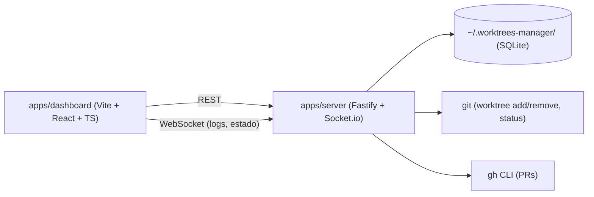

# ARCHITECTURE.md

> Detalle técnico de las decisiones enunciadas en `PROJECT_SPECIFICATION.md`. Si una decisión aquí y en la especificación entran en conflicto, este documento es el que se actualiza primero (es el más específico).

---

## 1. Monorepo & Tooling

- **Gestor de paquetes**: pnpm, versión fijada vía `packageManager` en `package.json` raíz + Corepack. Node.js LTS fijado en `.nvmrc`.
- **Orquestador**: ninguno (sin Turborepo) — solo `apps/dashboard` y `apps/server`, sin packages compartidos previstos en el alcance de v1. Se reevalúa si aparece un tercer consumidor o packages compartidos reales (YAGNI, `AGENTS.md` canon §1.4).
- **TypeScript**: `strict: true` en toda la base, sin excepciones locales. Un `tsconfig.base.json` en la raíz, extendido por cada app.
- **Lint**: ESLint flat config (`eslint.config.js`) en la raíz, compartido por ambas apps — sin `packages/eslint-config` separado mientras solo haya 2 consumidores.
- **Formato**: Prettier, integrado con ESLint (`eslint-config-prettier`).
- **Commits**: Conventional Commits, validados con `commitlint` + hook `commit-msg` de Husky. `lint-staged` corre Prettier (y ESLint si el coste de resolución de flat config por paquete lo permite) en pre-commit sobre el diff.
- **CI**: GitHub Actions (`ci.yml`) — install + lint + typecheck en cada PR, ampliable a test/build según se añadan (Fase 2+).

### 1.1 Dependencias entre apps

No hay `packages/*` compartidos en v1: `dashboard` y `server` no comparten código en tiempo de build, solo el contrato implícito de la API REST/WebSocket entre ellos (sin `packages/shared-types` todavía — se añade si la duplicación de tipos entre frontend/backend empieza a doler de verdad, criterio DRY/AHA del canon).

## 2. Frontend (`apps/dashboard`)

- Vite + React + TypeScript, sin SSR (SPA pura — no hay necesidad de SEO/indexación, es una herramienta local).
- **Estado servidor**: TanStack Query contra la API REST de `apps/server` (proyectos, worktrees, estado de PRs).
- **Estado cliente**: Zustand para estado de UI puro (paneles abiertos, filtros, selección activa).
- **Tiempo real**: cliente de Socket.io suscrito a los eventos de logs/estado que emite `apps/server`.
- **Estilos**: Tailwind CSS + shadcn/ui (componentes copiados/adaptados, no una dependencia de runtime).
- **Variables de entorno**: `import.meta.env`, nunca `process.env` (diferencia clave frente a un proyecto Next.js).

## 3. Backend (`apps/server`)

- Fastify como servidor HTTP (API REST) + adaptador de Socket.io sobre el mismo servidor HTTP para el canal de tiempo real.
- **Gestión de procesos hijos**: arranque/parada del comando de dev de cada worktree vía `execa` (o `child_process` si `execa` no aporta valor real sobre él), con el puerto asignado inyectado como variable de entorno al proceso.
- **Operaciones git**: `simple-git` (o `execa` invocando el `git` del sistema directamente) para `worktree add/remove`, `status --porcelain`. Nunca se reimplementa lógica de git en JS.
- **Integración PRs**: invocación de `gh` (CLI) vía `execa`, asumiendo sesión ya autenticada en la máquina — sin gestión de tokens propia.
- **Gestión de puertos**: comprobación de rango reservado por proyecto + verificación real de puerto libre (`detect-port` o equivalente) antes de asignar.

## 4. Registro central y persistencia

- `~/.worktrees-manager/` — directorio fuera de cualquier repo gestionado, creado por `apps/server` en el primer arranque si no existe.
- Persistencia en SQLite (`better-sqlite3`), fichero único dentro de ese directorio.
- **Esquema de datos (borrador inicial, se formaliza en Fase 2)**:
  - **Project**: id, nombre, ruta local, comando de arranque, rango de puertos, repo remoto (owner/name).
  - **Worktree**: id, project_id, rama, ruta, puerto, estado del proceso, PID (si corre), PR asociada (nº), creado_en.
  - **LogEntry**: worktree_id, timestamp, stream (stdout/stderr), contenido. Persistencia acotada (últimas N líneas o rotación por tamaño) — a decidir en Fase 2/5.

## 5. Config por proyecto (`.worktrees-manager.json`)

- Fichero opcional en la raíz de cada repo gestionado, versionado con el propio repo.
- Contiene comando de arranque + rango de puertos del proyecto.
- Lo lee/escribe siempre la app desde la UI (alta de proyecto); el usuario no lo edita a mano en el flujo normal.

## 6. Testing

- Vitest + Testing Library en `apps/dashboard` (unit/integración de componentes/hooks).
- Vitest (sin DOM) para lógica de `apps/server` (gestión de puertos, parsing de `git status`, etc.).
- E2E (Playwright u otro) queda fuera del alcance de la Fase 1 — se incorpora cuando haya flujos de negocio reales que probar (Fase 4+).

## 7. Multitasking con git worktrees

Coherente con el propio propósito de esta herramienta: el trabajo en paralelo sobre distintas fases/features de este mismo repo se hace en worktrees separados, no cambiando de rama sobre un único directorio con cambios a medio commitear. Ver `CLAUDE.md` "Cómo trabajar en este repo".
