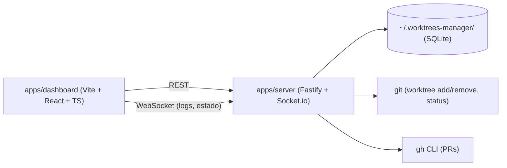

# ARCHITECTURE.md

> Detalle técnico de las decisiones enunciadas en `PROJECT_SPECIFICATION.md`. Si una decisión aquí y en la especificación entran en conflicto, este documento es el que se actualiza primero (es el más específico).

---

## 1. Monorepo & Tooling

- **Gestor de paquetes**: pnpm, versión fijada vía `packageManager` en `package.json` raíz + Corepack. Node.js LTS fijado en `.nvmrc`.
- **Orquestador**: ninguno (sin Turborepo) — solo `apps/dashboard` y `apps/server`, sin packages compartidos previstos en el alcance de v1. Se reevalúa si aparece un tercer consumidor o packages compartidos reales (YAGNI, `AGENTS.md` canon §1.4).
- **TypeScript**: `strict: true` en toda la base, sin excepciones locales. Un `tsconfig.base.json` en la raíz, extendido por cada app.
- **Lint**: ESLint flat config (`eslint.config.js`) en la raíz, compartido por ambas apps — sin `packages/eslint-config` separado mientras solo haya 2 consumidores.
- **Formato**: Prettier, integrado con ESLint (`eslint-config-prettier`).
- **Commits**: Conventional Commits, validados con `commitlint` + hook `commit-msg` de Husky. `lint-staged` corre Prettier (y ESLint si el coste de resolución de flat config por paquete lo permite) en pre-commit sobre el diff.
- **CI**: GitHub Actions (`ci.yml`) — install + lint + typecheck en cada PR, ampliable a test/build según se añadan (Fase 2+).

### 1.1 Dependencias entre apps

No hay `packages/*` compartidos en v1: `dashboard` y `server` no comparten código en tiempo de build, solo el contrato implícito de la API REST/WebSocket entre ellos (sin `packages/shared-types` todavía — se añade si la duplicación de tipos entre frontend/backend empieza a doler de verdad, criterio DRY/AHA del canon).

## 2. Frontend (`apps/dashboard`)

- Vite + React + TypeScript, sin SSR (SPA pura — no hay necesidad de SEO/indexación, es una herramienta local).
- **Organización por dominio**: `src/features/<dominio>/` (`api/` hooks de TanStack Query + funciones fetch, `components/`, `schemas.ts`) — `features/projects` y `features/filesystem` (Fase 3, explorador de carpetas reales de la máquina para el alta de proyectos: `DirectoryBrowserDialog` navega vía `GET /api/filesystem/directories`, ya que ni `<input type="file">` ni la File System Access API exponen la ruta absoluta real de una carpeta seleccionada en el navegador). `src/components/ui/` es el design system (shadcn/ui), ciego al dominio.
- **Estado servidor**: TanStack Query contra la API REST de `apps/server` (proyectos, worktrees, estado de PRs).
- **Estado cliente**: Zustand para estado de UI puro (paneles abiertos, filtros, selección activa) — todavía no introducido: la Fase 3 solo necesita "qué diálogo está abierto", cubierto con `useState` local en `ProjectsPage`; se añade Zustand cuando aparezca estado de UI real compartido entre componentes no relacionados.
- **Routing**: sin `react-router` todavía — una única vista (`ProjectsPage`). Se introduce en la fase que añada una segunda vista real (worktrees por proyecto, Fase 4+), envolviendo lo ya construido sin reescrituras.
- **Formularios**: React Hook Form + Zod. El resolver es `standardSchemaResolver` de `@hookform/resolvers/standard-schema` (no `zodResolver` de `@hookform/resolvers/zod`, que en la versión instalada asume la forma interna de Zod v3) — Zod v4 implementa el estándar [Standard Schema](https://github.com/standard-schema/standard-schema) y ese es el resolver soportado. Con validaciones `z.coerce`, `useForm` se tipa `<InputSchema, unknown, OutputSchema>` (vía `z.input`/`z.output`), no con un único tipo — RHF necesita distinguir el shape crudo del campo (antes de coercionar) del shape ya parseado que recibe el `onSubmit`.
- **Tiempo real**: cliente de Socket.io suscrito a los eventos de logs/estado que emite `apps/server` (a partir de Fase 5).
- **Estilos**: Tailwind CSS v4 (`@tailwindcss/vite`) + shadcn/ui, estilo `base-nova` (primitivos headless `@base-ui/react`, no Radix). Los componentes de `src/components/ui/` se copian/adaptan (no son una dependencia de runtime), pero el estilo `base-nova` sí trae un paquete `shadcn` con el reset/tokens CSS base como dependencia — es el propio CLI oficial el que lo resuelve así, no una elección nuestra que contradiga el principio.
- **Cliente HTTP**: `src/lib/api-client.ts` (`apiRequest`), sin librería — `fetch` nativo con manejo de errores (`ApiError`) y parseo de body condicionado al método/presencia de body (un `Content-Type: application/json` en una petición sin cuerpo, p. ej. `DELETE`, hace que Fastify la rechace con 400/500).
- **Proxy de dev**: `vite.config.ts` → `server.proxy["/api"]` hacia `apps/server` (evita CORS en desarrollo sin añadir `@fastify/cors`; en producción, Fase 8 probablemente sirva ambos desde el mismo origen).
- **Variables de entorno**: `import.meta.env`, nunca `process.env` (diferencia clave frente a un proyecto Next.js).
- **Testing**: Vitest + Testing Library + MSW (`src/test/`), introducido en Fase 3 junto con la primera feature real.

## 3. Backend (`apps/server`)

- Fastify como servidor HTTP (API REST) + adaptador de Socket.io sobre el mismo servidor HTTP para el canal de tiempo real.
- **Fábrica de la app** (`src/app.ts`, `buildApp(db)`): separa la construcción de la instancia Fastify (type provider Zod, decorator `fastify.db`, registro de plugins de dominio, `setErrorHandler`) del arranque real (`src/index.ts`, que solo añade `openRegistry()` + `app.listen()`) — necesario para testear rutas con `fastify.inject()` sin levantar un puerto real.
- **Organización por dominio**: cada dominio de negocio es una carpeta con su propio `schemas.ts` (Zod), `repository.ts` (acceso a SQLite si aplica), y `plugin.ts` (rutas Fastify) — `src/projects/` (Fase 3) y `src/filesystem/` (Fase 3, explorador de directorios reales de la máquina para el alta de proyectos: el navegador no expone rutas absolutas de un `<input type="file">`/File System Access API, así que el backend —con acceso pleno al filesystem— es quien lista directorios vía `GET /api/filesystem/directories`). Validación Zod vía `fastify-type-provider-zod`.
- **Límite del explorador de directorios**: `GET /api/filesystem/directories` solo permite navegar dentro del home del usuario (`realpathSync(homedir())`, resolviendo symlinks para que no sirvan de escape) — 403 fuera de ese árbol. Como el servidor escucha en `0.0.0.0` (§1), sin este límite el endpoint permitiría enumerar el filesystem completo de la máquina desde la red local. No aplica al campo de texto libre de "Ruta local" en el alta de proyecto (ruta deliberada del usuario, puede vivir fuera del home).
- **Errores de dominio** (`src/errors.ts`): clases propias (`NotFoundError`, `DuplicateProjectPathError`, etc.) mapeadas a status HTTP en el único `setErrorHandler` de `app.ts` — nunca `try/catch` repetido por ruta para el caso genérico.
- **Gestión de procesos hijos**: arranque/parada del comando de dev de cada worktree vía `execa` (o `child_process` si `execa` no aporta valor real sobre él), con el puerto asignado inyectado como variable de entorno al proceso.
- **Operaciones git**: `simple-git` (o `execa` invocando el `git` del sistema directamente) para `worktree add/remove`, `status --porcelain`. Nunca se reimplementa lógica de git en JS.
- **Integración PRs**: invocación de `gh` (CLI) vía `execa`, asumiendo sesión ya autenticada en la máquina — sin gestión de tokens propia.
- **Gestión de puertos**: comprobación de rango reservado por proyecto + verificación real de puerto libre (`detect-port` o equivalente) antes de asignar.

## 4. Registro central y persistencia

- `~/.worktrees-manager/` — directorio fuera de cualquier repo gestionado, creado por `apps/server` en el primer arranque si no existe.
- Persistencia en SQLite (`better-sqlite3`), fichero único dentro de ese directorio.
- **Esquema de datos** (tablas `projects`, `worktrees`, `log_entries` — formalizado en Fase 2, decisiones de migraciones/IDs en [ADR-0001](./adr/0001-esquema-datos-y-migraciones-sqlite.md)):
  - **Project**: id (UUID), nombre, ruta local, comando de arranque, rango de puertos, repo remoto (owner/name).
  - **Worktree**: id (UUID), project_id, rama, ruta, puerto, estado del proceso, PID (si corre), PR asociada (nº), creado_en.
  - **LogEntry**: id (autoincremental), worktree_id, timestamp, stream (stdout/stderr), contenido. Persistencia acotada (últimas N líneas o rotación por tamaño) — sigue pendiente, a decidir en Fase 5 cuando exista el flujo real de escritura de logs.
- **Migraciones**: runner propio (`apps/server/src/db/migrate.ts`), sin librería externa — array de migraciones trackeadas en `schema_migrations`, aplicadas solo hacia delante.

## 5. Config por proyecto (`.worktrees-manager.json`)

- Fichero opcional en la raíz de cada repo gestionado, versionado con el propio repo.
- Contiene comando de arranque + rango de puertos del proyecto.
- Lo lee/escribe siempre la app desde la UI (alta de proyecto); el usuario no lo edita a mano en el flujo normal.

## 6. Testing

- Vitest + Testing Library en `apps/dashboard` (unit/integración de componentes/hooks).
- Vitest (sin DOM) para lógica de `apps/server` (gestión de puertos, parsing de `git status`, etc.).
- E2E (Playwright u otro) queda fuera del alcance de la Fase 1 — se incorpora cuando haya flujos de negocio reales que probar (Fase 4+).

## 7. Multitasking con git worktrees

Coherente con el propio propósito de esta herramienta: el trabajo en paralelo sobre distintas fases/features de este mismo repo se hace en worktrees separados, no cambiando de rama sobre un único directorio con cambios a medio commitear. Ver `CLAUDE.md` "Cómo trabajar en este repo".
