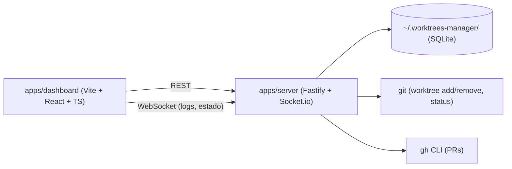

# ARCHITECTURE.md

> Detalle técnico de las decisiones enunciadas en `PROJECT_SPECIFICATION.md`. Si una decisión aquí y en la especificación entran en conflicto, este documento es el que se actualiza primero (es el más específico).

---

## 1. Monorepo & Tooling

- **Gestor de paquetes**: pnpm, versión fijada vía `packageManager` en `package.json` raíz + Corepack. Node.js LTS fijado en `.nvmrc`.
- **Orquestador**: ninguno (sin Turborepo) — solo `apps/dashboard` y `apps/server`, sin packages compartidos previstos en el alcance de v1. Se reevalúa si aparece un tercer consumidor o packages compartidos reales (YAGNI, `AGENTS.md` canon §1.4).
- **TypeScript**: `strict: true` en toda la base, sin excepciones locales. Un `tsconfig.base.json` en la raíz, extendido por cada app.
- **Lint**: ESLint flat config (`eslint.config.js`) en la raíz, compartido por ambas apps — sin `packages/eslint-config` separado mientras solo haya 2 consumidores.
- **Formato**: Prettier, integrado con ESLint (`eslint-config-prettier`).
- **Commits**: Conventional Commits, validados con `commitlint` + hook `commit-msg` de Husky. `lint-staged` corre Prettier (y ESLint si el coste de resolución de flat config por paquete lo permite) en pre-commit sobre el diff.
- **CI**: GitHub Actions (`ci.yml`) — install + lint + typecheck en cada PR, ampliable a test/build según se añadan (Fase 2+).

### 1.1 Dependencias entre apps

No hay `packages/*` compartidos en v1: `dashboard` y `server` no comparten código en tiempo de build, solo el contrato implícito de la API REST/WebSocket entre ellos (sin `packages/shared-types` todavía — se añade si la duplicación de tipos entre frontend/backend empieza a doler de verdad, criterio DRY/AHA del canon).

## 2. Frontend (`apps/dashboard`)

- Vite + React + TypeScript, sin SSR (SPA pura — no hay necesidad de SEO/indexación, es una herramienta local).
- **Organización por dominio**: `src/features/<dominio>/` (`api/` hooks de TanStack Query + funciones fetch, `components/`, `schemas.ts`) — `features/projects` (Fase 3), `features/filesystem` (Fase 3, explorador de carpetas reales de la máquina para el alta de proyectos: `DirectoryBrowserDialog` navega vía `GET /api/filesystem/directories`, ya que ni `<input type="file">` ni la File System Access API exponen la ruta absoluta real de una carpeta seleccionada en el navegador) y `features/worktrees` (Fase 4, ciclo de vida de worktrees por proyecto; Fase 5, arranque/parada, logs en vivo y todo lo descrito en §2 más abajo). `src/components/ui/` es el design system (shadcn/ui), ciego al dominio.
- **Estado servidor**: TanStack Query contra la API REST de `apps/server` (proyectos, worktrees, estado de PRs).
- **Estado cliente**: Zustand para estado de UI puro (paneles abiertos, filtros, selección activa) — todavía no introducido: ni la Fase 3 ni la Fase 4 lo han necesitado ("qué diálogo está abierto" se cubre con `useState` local en cada página/diálogo); se añade Zustand cuando aparezca estado de UI real compartido entre componentes no relacionados.
- **Routing**: `react-router` (`createBrowserRouter`/`RouterProvider`), introducido en una mejora de interfaz posterior a la Fase 4 para el layout maestro-detalle (sidebar de proyectos + panel de contenido) — decisión completa en [ADR-0004](./adr/0004-navegacion-maestro-detalle-con-router.md). Rutas declaradas a mano en `src/app-routes.tsx` (`RouteObject[]`, reutilizado también en tests vía `createMemoryRouter`), no por convención de ficheros: `AppLayout` (sidebar + `<Outlet/>`) como layout raíz, `index` (`ProjectsIndexRoute`, redirige al primer proyecto o muestra estado vacío) y `projects/:projectId` (`ProjectDetailPage`, datos generales + worktrees) como rutas hijas. El proyecto seleccionado vive en la URL, no en estado local. `Crear worktree`/`Borrar worktree` son diálogos independientes (mismo patrón que `CreateProjectDialog`/`EditProjectDialog`/`DeleteProjectDialog`); el antiguo paso "listado" de worktrees, que antes vivía dentro de un `Dialog` con pasos internos, ahora es contenido normal de `ProjectDetailPage`.
- **Formularios**: React Hook Form + Zod. El resolver es `standardSchemaResolver` de `@hookform/resolvers/standard-schema` (no `zodResolver` de `@hookform/resolvers/zod`, que en la versión instalada asume la forma interna de Zod v3) — Zod v4 implementa el estándar [Standard Schema](https://github.com/standard-schema/standard-schema) y ese es el resolver soportado. Con validaciones `z.coerce`, `useForm` se tipa `<InputSchema, unknown, OutputSchema>` (vía `z.input`/`z.output`), no con un único tipo — RHF necesita distinguir el shape crudo del campo (antes de coercionar) del shape ya parseado que recibe el `onSubmit`.
- **Tiempo real** (Fase 5, [ADR-0007](./adr/0007-arranque-parada-y-logs-de-entornos-dev.md)): instancia compartida de `socket.io-client` (`src/lib/socket.ts`, sin URL — conecta al mismo origen vía el proxy `/socket.io` de `vite.config.ts` en dev). Salas por worktree (`worktree:${id}`); `useWorktrees` se une a la sala de cada worktree de la lista para reflejar `process-status` en tiempo real (`queryClient.setQueryData`, no `invalidateQueries`); `useWorktreeLogs` implementa el flujo de unión histórico+socket sin pérdida/duplicado descrito en el ADR (cursor por `id`). El payload de `log-entry` lleva `{worktreeId, entry}` (no el `LogEntry` a secas): un cliente unido a varias salas a la vez no tendría forma de atribuir una línea al worktree correcto — hallazgo real, ver [ADR-0008](./adr/0008-deteccion-de-puertos-y-feedback-de-arranque.md). `useWorktrees` también trackea `process-step` (instalando dependencias / arrancando el comando) y `detected-ports` (puertos reales de cada app en un monorepo, con su etiqueta), ambos mostrados en la card del worktree.
- **Estilos**: Tailwind CSS v4 (`@tailwindcss/vite`) + shadcn/ui, estilo `base-nova` (primitivos headless `@base-ui/react`, no Radix). Los componentes de `src/components/ui/` se copian/adaptan (no son una dependencia de runtime), pero el estilo `base-nova` sí trae un paquete `shadcn` con el reset/tokens CSS base como dependencia — es el propio CLI oficial el que lo resuelve así, no una elección nuestra que contradiga el principio.
- **Cliente HTTP**: `src/lib/api-client.ts` (`apiRequest`), sin librería — `fetch` nativo con manejo de errores (`ApiError`) y parseo de body condicionado al método/presencia de body (un `Content-Type: application/json` en una petición sin cuerpo, p. ej. `DELETE`, hace que Fastify la rechace con 400/500).
- **Proxy de dev**: `vite.config.ts` → `server.proxy["/api"]` hacia `apps/server` (evita CORS en desarrollo sin añadir `@fastify/cors`; en producción, Fase 8 probablemente sirva ambos desde el mismo origen).
- **Variables de entorno**: `import.meta.env`, nunca `process.env` (diferencia clave frente a un proyecto Next.js).
- **Testing**: Vitest + Testing Library + MSW (`src/test/`), introducido en Fase 3 junto con la primera feature real.

## 3. Backend (`apps/server`)

- Fastify como servidor HTTP (API REST) + adaptador de Socket.io sobre el mismo servidor HTTP para el canal de tiempo real.
- **Fábrica de la app** (`src/app.ts`, `buildApp(db)`): separa la construcción de la instancia Fastify (type provider Zod, decorator `fastify.db`, registro de plugins de dominio, `setErrorHandler`) del arranque real (`src/index.ts`, que solo añade `openRegistry()` + `app.listen()`) — necesario para testear rutas con `fastify.inject()` sin levantar un puerto real.
- **Organización por dominio**: cada dominio de negocio es una carpeta con su propio `schemas.ts` (Zod), `repository.ts` (acceso a SQLite si aplica), y `plugin.ts` (rutas Fastify) — `src/projects/` (Fase 3, más `config-file.ts` para `.worktrees-manager.json`, ver §6), `src/filesystem/` (Fase 3, explorador de directorios reales de la máquina para el alta de proyectos: el navegador no expone rutas absolutas de un `<input type="file">`/File System Access API, así que el backend —con acceso pleno al filesystem— es quien lista directorios vía `GET /api/filesystem/directories`) y `src/worktrees/` (Fase 4, ciclo de vida de worktrees — `git-worktree.ts`, `port-allocator.ts`, `project-lock.ts`; Fase 5, entornos de dev — `process-manager.ts`, `log-repository.ts`, `package-manager.ts`, `env-files.ts`, `post-create-command.ts`, ver más abajo). Validación Zod vía `fastify-type-provider-zod`.
- **Límite del explorador de directorios**: `GET /api/filesystem/directories` solo permite navegar dentro del home del usuario (`realpathSync(homedir())`, resolviendo symlinks para que no sirvan de escape) — 403 fuera de ese árbol. Como el servidor escucha en `0.0.0.0` (§1), sin este límite el endpoint permitiría enumerar el filesystem completo de la máquina desde la red local. No aplica al campo de texto libre de "Ruta local" en el alta de proyecto (ruta deliberada del usuario, puede vivir fuera del home).
- **Errores de dominio** (`src/errors.ts`): clases propias (`NotFoundError`, `DuplicateProjectPathError`, etc.) mapeadas a status HTTP en el único `setErrorHandler` de `app.ts` — nunca `try/catch` repetido por ruta para el caso genérico.
- **Gestión de procesos hijos** (`src/worktrees/process-manager.ts`, Fase 5, [ADR-0007](./adr/0007-arranque-parada-y-logs-de-entornos-dev.md)): `createProcessManager({db, io})`, factoría (no singleton de módulo, a diferencia de `project-lock.ts`) decorada como `fastify.processManager`. Arranca `worktree.devCommandOverride ?? project.devCommand` (override de texto libre por worktree, [ADR-0009](./adr/0009-comando-de-arranque-por-worktree.md)) con `execa` (`shell:true`, `PORT=<puerto del worktree>` en el entorno, sin `detached`), máquina de estados parado/arrancando/corriendo/error basada en los eventos nativos `spawn`/`error`/`close` del proceso (nunca heurísticas de tiempo ni parseo de su output — `close`, no `exit`: Node no garantiza que los streams de stdio hayan terminado de emitir datos en `exit`), y `tree-kill` para parar el árbol completo (necesario porque `shell:true` solo expone el PID del shell, no el de sus hijos reales). Si falta `node_modules`, lo instala primero (detectado por lockfile, `package-manager.ts`) antes de arrancar. Detecta puertos reales y su app anunciados en el output (regex, sin escaneo de SO, [ADR-0008](./adr/0008-deteccion-de-puertos-y-feedback-de-arranque.md)) y emite el sub-paso en curso (`process-step`). Al arrancar el servidor se resetea cualquier `process_status` no-`stopped` a `stopped` (no hay forma de recuperar un handle real de una ejecución anterior) y se poda `log_entries` por si acaso.
- **Bootstrap de un worktree nuevo** (Fase 5, [ADR-0010](./adr/0010-copia-de-ficheros-env-al-crear-un-worktree.md)/[ADR-0011](./adr/0011-comando-posterior-a-la-creacion.md)): al crear un worktree, se copian los `.env*` gitignoreados del repo principal (`src/worktrees/env-files.ts`, delega en `git ls-files --others --ignored` la decisión de qué está realmente ignorado, no reimplementa el matching de `.gitignore`) y, si el proyecto tiene `postCreateCommand` configurado, se ejecuta una sola vez (`src/worktrees/post-create-command.ts`, instala dependencias primero si hacen falta) — su output se vuelca como logs del propio worktree. Ninguno de los dos pasos es fatal si falla: el worktree se crea igual.
- **Operaciones git** (`src/worktrees/git-worktree.ts`, Fase 4): `execa` invocando el `git` del sistema directamente para `worktree add/remove`, resolución de rama por defecto/actual y listado de ramas locales — nunca se reimplementa lógica de git en JS, y cada proceso hijo fija `LC_ALL=C` explícitamente porque el resto del módulo hace matching por regex sobre el stderr real (p. ej. "already exists", "contains modified..."), que sale localizado según el `LANG` de la máquina si no se fuerza el locale (bug real encontrado en verificación manual, ver adenda de Fase 4 en `ROADMAP.md`). `git status --porcelain` (estado de cambios sin commitear) queda pendiente de Fase 6.
- **Ubicación en disco de los worktrees**: `<project.localPath>/.worktrees/<rama>`, anidado dentro del propio proyecto (no hermano, revisión de la convención original de la Fase 4 — ver [ADR-0005](./adr/0005-worktrees-anidados-y-abrir-terminal.md)). `ensureWorktreesDirectoryIgnored` añade `.worktrees/` al `.gitignore` del proyecto antes de la primera creación, para que el contenido de cada worktree no ensucie el `git status` del repo principal.
- **Abrir terminal** (`src/worktrees/terminal.ts`): si el usuario tiene configurado un comando preferido en los ajustes globales (ver §5), lo ejecuta sustituyendo el placeholder `{path}`; si no, cae al fallback automático por plataforma — `open -a Terminal` en macOS, Windows Terminal (con fallback a `cmd.exe`) en Windows, el primero disponible de `gnome-terminal`/`konsole`/`xfce4-terminal`/`xterm` en Linux. El lanzador real se inyecta tras una interfaz (`TerminalLauncher`) para poder testear la selección de comando por plataforma sin abrir ventanas reales en CI. Detalle completo en [ADR-0005](./adr/0005-worktrees-anidados-y-abrir-terminal.md) y [ADR-0006](./adr/0006-ajustes-globales-puertos-y-terminal.md).
- **Integración PRs**: invocación de `gh` (CLI) vía `execa`, asumiendo sesión ya autenticada en la máquina — sin gestión de tokens propia. Pendiente de Fase 7.
- **Gestión de puertos** (`src/worktrees/port-allocator.ts`, Fase 4): sin `detect-port` — bind real (`net.createServer().listen(port)` + captura de `EADDRINUSE`) excluyendo antes los puertos ya asignados a cualquier worktree existente (consulta SQLite), dentro de un único rango global configurable en los ajustes de la app (ver §5). Concurrencia entre altas simultáneas resuelta con un lock en memoria de clave fija (`project-lock.ts`, ya no por `projectId` — el rango es global, así que dos proyectos distintos también compiten por el mismo pool, ver [ADR-0006](./adr/0006-ajustes-globales-puertos-y-terminal.md)) + un índice `UNIQUE` global sobre `worktrees.port` como backstop en SQLite. Detalle original en [ADR-0003](./adr/0003-ciclo-de-vida-de-worktrees.md).

## 4. Registro central y persistencia

- `~/.worktrees-manager/` — directorio fuera de cualquier repo gestionado, creado por `apps/server` en el primer arranque si no existe.
- Persistencia en SQLite (`better-sqlite3`), fichero único dentro de ese directorio.
- **Esquema de datos** (tablas `projects`, `worktrees`, `log_entries` — formalizado en Fase 2, decisiones de migraciones/IDs en [ADR-0001](./adr/0001-esquema-datos-y-migraciones-sqlite.md)):
  - **Project**: id (UUID), nombre, ruta local, comando de arranque, comando posterior a la creación (nulable, Fase 5, [ADR-0011](./adr/0011-comando-posterior-a-la-creacion.md)), repo remoto (owner/name).
  - **Worktree**: id (UUID), project_id, rama, ruta, puerto, estado del proceso, PID (si corre), override del comando de arranque (nulable, Fase 5, [ADR-0009](./adr/0009-comando-de-arranque-por-worktree.md)), PR asociada (nº), creado_en. `detectedPorts` (puertos reales + su app) viaja en la respuesta de la API pero **no** se persiste — se calcula en caliente desde el proceso trackeado en memoria (`process-manager.ts`).
  - **LogEntry**: id (autoincremental), worktree_id, timestamp, stream (stdout/stderr), contenido. Retención acotada a las últimas 2000 filas por worktree (Fase 5, [ADR-0007](./adr/0007-arranque-parada-y-logs-de-entornos-dev.md)), podada en tres disparadores baratos (cada ~150 líneas nuevas en caliente, al `close` del proceso, y en un barrido al arrancar el servidor) — nunca en cada línea nueva.
  - **AppSettings** (Fase 4, [ADR-0006](./adr/0006-ajustes-globales-puertos-y-terminal.md)): fila única (`CHECK (id = 1)`, sembrada en la propia migración) con comando de terminal preferido (nulable — `null` = fallback automático por plataforma) y el rango de puertos global (`port_range_start`/`port_range_end`).
- **Migraciones**: runner propio (`apps/server/src/db/migrate.ts`), sin librería externa — array de migraciones trackeadas en `schema_migrations`, aplicadas solo hacia delante.

## 5. Ajustes globales de la app

- `src/settings/` (Fase 4, [ADR-0006](./adr/0006-ajustes-globales-puertos-y-terminal.md)): mismo patrón `schemas.ts`/`repository.ts`/`plugin.ts` que el resto de dominios, persistido en la fila única `app_settings` descrita arriba — no un fichero de configuración aparte.
- **Terminal preferida**: lista estática y curada de terminales populares por plataforma (`terminalPresets()` en `src/worktrees/terminal.ts`), sin detección en tiempo real de lo que hay instalado. El usuario elige un preset, o escribe un comando personalizado con placeholder `{path}`; ambos se guardan de la misma forma (comando ya resuelto). `null` (por defecto) preserva el fallback automático por plataforma de ADR-0005.
- **Rango de puertos**: único y global para toda la app (ya no por proyecto, ver §4 de arriba y ADR-0006), configurable desde el mismo diálogo de ajustes en el dashboard.

## 6. Config por proyecto (`.worktrees-manager.json`)

- Fichero opcional en la raíz de cada repo gestionado, versionado con el propio repo — así, quien lo configura primero y lo comitea, el resto del equipo lo hereda automáticamente al añadir el proyecto en su propia máquina, en vez de tener que volver a escribirlo (ver [ADR-0011](./adr/0011-comando-posterior-a-la-creacion.md)).
- Contiene el comando de arranque del proyecto y, si está configurado, el comando posterior a la creación (Fase 5) — este último se omite del fichero por completo cuando no hay ninguno, en vez de escribir `null`.
- Lo lee/escribe siempre la app desde la UI (alta/edición de proyecto); el usuario no lo edita a mano en el flujo normal, aunque sí lo comitea él mismo cuando quiere compartirlo.
- **No todo lo que se puede comitear, se comitea a ciegas**: `devCommand` es puramente descriptivo (arrancar un servidor no tiene efectos secundarios). `postCreateCommand` dispara una acción real (p. ej. migrar/sembrar una base de datos) para cualquiera que cree un worktree a partir de esa config — solo tiene sentido comitearlo si esa acción es segura de repetir automáticamente para todo el equipo (p. ej. una base de datos local por worktree, no un recurso compartido).

## 7. Testing

- Vitest + Testing Library en `apps/dashboard` (unit/integración de componentes/hooks).
- Vitest (sin DOM) para lógica de `apps/server`, incluida la de `apps/server/src/worktrees/` (Fase 4: git real contra repos temporales vía `mkdtempSync`, nunca se mockea git — gestión de puertos, resolución de rama por defecto, alta/borrado real de worktrees, y pruebas de concurrencia con dos altas simultáneas tanto del mismo proyecto como de dos proyectos distintos, esta última cubriendo el fix del lock global de puertos de [ADR-0006](./adr/0006-ajustes-globales-puertos-y-terminal.md)). `process-manager.test.ts` (Fase 5) arranca procesos hijo reales (scripts `node` temporales vía `mkdtempSync`, nunca se mockea `execa`), mismo criterio que git.
- **Excepción acotada al patrón `fastify.inject()`**: `apps/server/src/socket.test.ts` (Fase 5) es la única suite que necesita `.listen()` real + un cliente `socket.io-client` real conectándose, porque un handshake de WebSocket no se puede ejercer con `fastify.inject()` (que no abre un socket TCP real).
- Verificación manual en navegador con Playwright: sin un runner E2E propio todavía (se incorpora si hace falta automatizarla), pero ya en uso desde la Fase 3 como paso de cierre de cada fase con UI — contra un repo git de prueba real, no mockeado.

## 8. Multitasking con git worktrees

Coherente con el propio propósito de esta herramienta: el trabajo en paralelo sobre distintas fases/features de este mismo repo se hace en worktrees separados, no cambiando de rama sobre un único directorio con cambios a medio commitear. Ver `CLAUDE.md` "Cómo trabajar en este repo".
